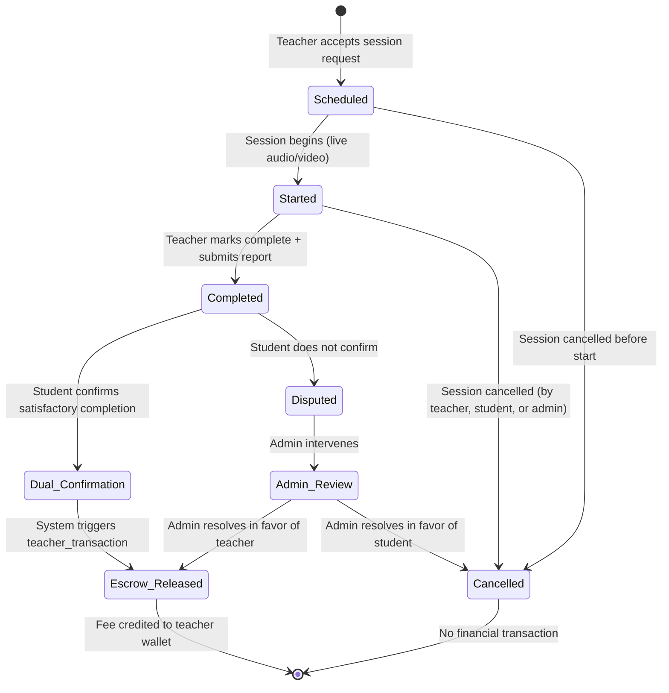
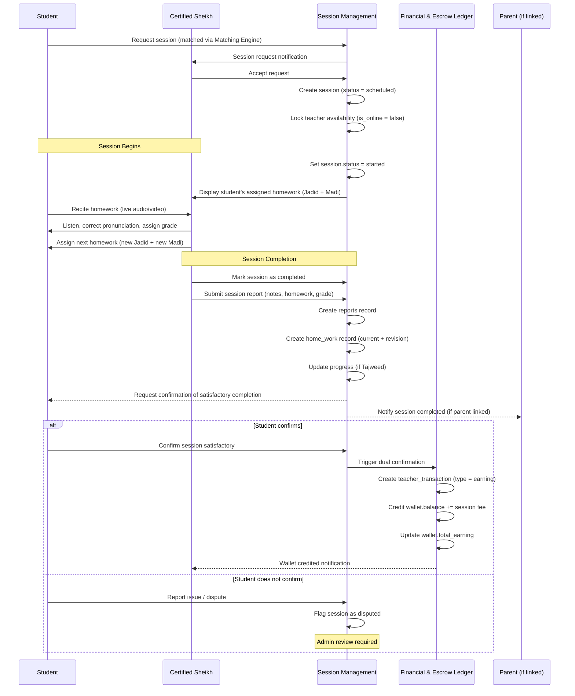
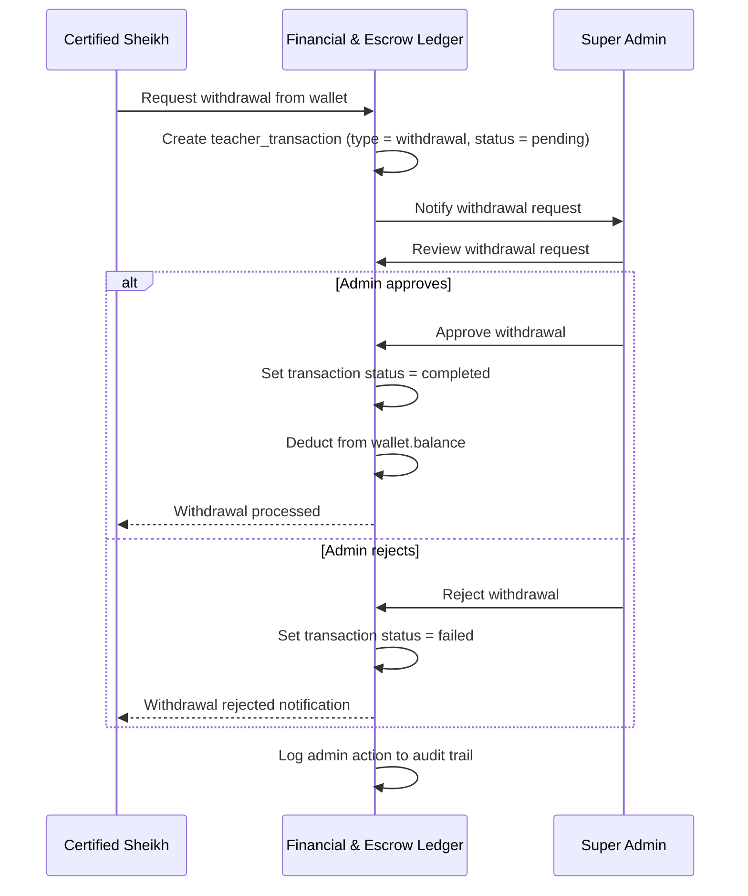

# Workflow 03 — Session Lifecycle & Escrow

> **Source of truth:** `draft_docs/1-sc.en.md` §3, `draft_docs/2-admin-sc.en.md` §5A
> **Related:** `docs/domain/GLOSSARY.md`, `docs/specs/state-machine-invariants.md`

---

## 1. Overview

The Session Lifecycle governs the complete flow from session creation through completion, report submission, dual confirmation, and financial escrow. The workflow distinguishes between the first session (diagnostic/correction) and subsequent sessions (homework review and grading).

---

## 2. State Machine: Session Lifecycle

---

## 3. Sequence Diagram: Complete Session Flow (Subsequent Session)

---

## 4. First Session vs. Subsequent Sessions

### 4.1 First Session (Diagnostic & Correction / Tas-heeh)

| Aspect | First Session |
|---|---|
| **Purpose** | Diagnostic assessment and pronunciation correction |
| **Teacher Action** | Recites to the student and corrects pronunciation |
| **Homework Assignment** | Assigns new memorization (Jadid: Ayah X to Ayah Y) and past review (Madi: Ayah A to Ayah B, or specific Surah/Juz) |
| **Homework Evaluation** | **None** — no prior homework exists to evaluate |
| **Report** | Session report submitted with initial assessment notes |

### 4.2 Subsequent Sessions

| Aspect | Subsequent Sessions |
|---|---|
| **Purpose** | Homework review, grading, and next assignment |
| **Teacher Action** | Reviews student's assigned homework (displayed by system), listens to recitation, assigns evaluation grade for previous session's homework |
| **Homework Evaluation** | Grades previous homework (e.g., 9/10, 5/10) |
| **Homework Assignment** | Assigns next homework (new Jadid + new Madi) |
| **Report** | Session report submitted with performance notes, grades, and next assignment |
| **Cross-Teacher Continuity** | When a student enters a session with any teacher (even a different teacher), the system displays the student's assigned homework — ensuring continuity across non-dedicated matching |

---

## 5. Session Report Structure

The teacher submits a **Session Report** at the end of every completed session containing:

| Field | Description | Schema Mapping |
|---|---|---|
| **Teacher Notes** | Detailed performance notes and recitation assessment | `reports.teacher_notes` |
| **Student Rating by Teacher** | Numerical/grade evaluation (0-5 scale) | `reports.student_rating_by_teacher` |
| **New Memorization (Jadid)** | From Ayah X to Ayah Y in the new section | `home_work.current_from_ayah`, `home_work.current_to_ayah` |
| **New Memorization Grade** | Grade for the new memorization homework | `home_work.current_grade` (0-100) |
| **Past Review (Madi)** | From Ayah A to Ayah B, or a specific Surah/Juz | `home_work.revision_from_ayah`, `home_work.revision_to_ayah` |
| **Past Review Grade** | Grade for the past review homework | `home_work.revision_grade` (0-100) |

---

## 6. Dual Confirmation & Financial Escrow

### 6.1 Dual Confirmation Flow
1. **Teacher marks session as completed** and submits the report.
2. **Student confirms** that the session was completed satisfactorily.
3. Upon dual confirmation, a **Teacher Transaction** (`teacher_transaction`) is triggered immediately.

### 6.2 Financial Escrow Rules
| Rule | Detail |
|---|---|
| **Transaction Type** | `earning` |
| **Amount** | Session fee (determined by plan pricing) |
| **Wallet Credit** | `wallet.balance += amount` |
| **Total Earning Update** | `wallet.total_earning += amount` |
| **Timing** | Immediate upon dual confirmation |
| **Immutability** | Financial records are immutable; corrections via adjustment transactions only |

### 6.3 Teacher Withdrawal Flow

---

## 7. Admin Session Governance

The Super Admin has the following session governance capabilities:

| Capability | Description |
|---|---|
| **Global Session Directory** | Real-time visibility into all platform sessions (Scheduled, In-Progress, Completed, Cancelled) |
| **Advanced Filtering** | Filter by Teacher, Student, Session Type (Regular vs. Teacher Evaluation), and Date range |
| **Reschedule Sessions** | Change session timing |
| **Cancel Sessions** | Cancel any session |
| **Reassign Teachers** | Assign a different teacher to a session |
| **Join Live Sessions** | Access live session links for monitoring |
| **Review Reports & Evaluations** | Inspect `reports` and `evaluations` for any session |

---

## 8. Data Entities Involved

| Entity | Role in Workflow |
|---|---|
| `session` | Core entity; tracks status lifecycle (scheduled → started → completed/cancelled) |
| `reports` | Teacher's session report (notes, student rating) |
| `home_work` | Homework assignment (Jadid + Madi with grades) |
| `evaluations` | Student evaluation of teacher (affects rating) |
| `teacher_transaction` | Financial transaction crediting teacher wallet on dual confirmation |
| `wallet` | Teacher's earnings balance |
| `progress` | Tajweed progress update (if applicable) |

---

## 9. Resolved Decisions

> See Resolved Decisions in `docs/specs/open-decisions-and-gaps.md` for the full catalog.

- **✅ RESOLVED (B.2):** 24-hour dual confirmation timeout. If neither party confirms within 24 hours, the session is auto-cancelled and any held funds are refunded. `session.confirmation_deadline` and `session.confirmed_by_student_at` / `session.confirmed_by_teacher_at` columns added.
- **✅ RESOLVED (B.3):** Platform sets the session price (fixed per subject/plan). `session.fee` column added. The fee is determined by the platform based on the plan and subject type.
- **✅ RESOLVED (A.8):** `session_type` enum added to the `session` table (`student_session`, `teacher_evaluation`, `re_evaluation`). Admin can filter by session type.
- **✅ RESOLVED (B.4):** Hold at request, decrement at completion (escrow model). `session.fee_held` boolean column added. When a session is requested, the fee is held (escrow). Upon dual confirmation, the balance is decremented and the teacher's wallet is credited. If cancelled, held funds are released back.
- **✅ RESOLVED (B.11):** Use enum for Surah/Juz representation in homework. `home_work.current_surah_juz` and `home_work.revision_surah_juz` columns added (`surah_juz_ref` enum) for non-contiguous review assignments.
- **✅ RESOLVED (B.18):** Admin arbitration for post-confirmation disputes. `session_status` enum extended with `disputed` value. After dual confirmation, if a student disputes, the session enters `disputed` status and an admin reviews via the audit log.
