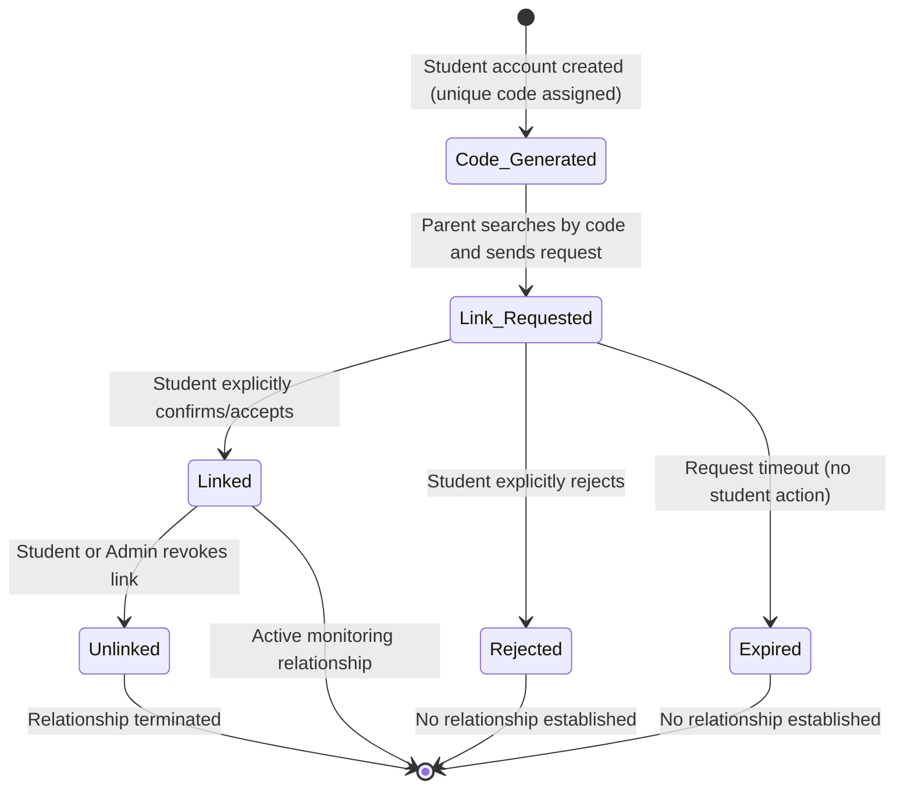
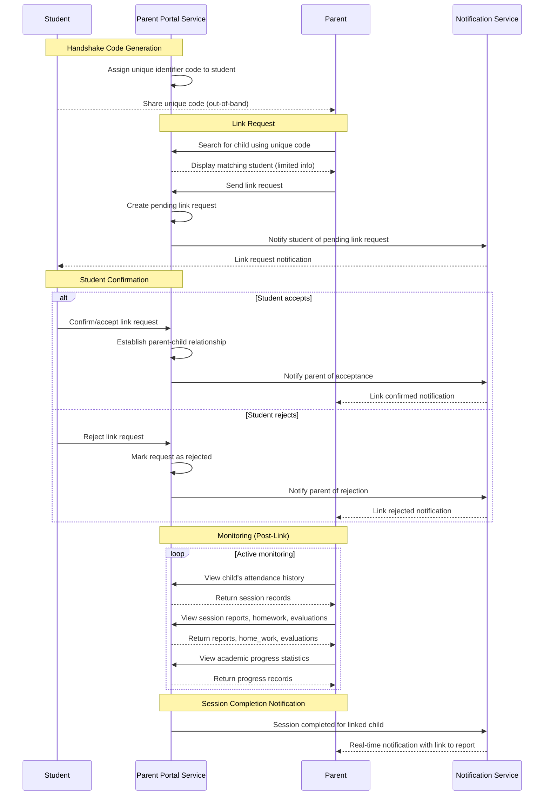

# Workflow 04 — Parent Supervision Handshake

> **Source of truth:** `draft_docs/1-sc.en.md` §7, §8
> **Related:** `docs/domain/GLOSSARY.md`, `docs/specs/state-machine-invariants.md`
> **Implementation:** the §4.2 parent search read-side contract is canonically documented in `docs/parents/handshake-code-discovery.md`.

---

## 1. Overview

The Parent Supervision system enables parents to monitor their children's Quran learning progress through a secure handshake-based linking process. In the MVP, parents have read-only monitoring privileges. The handshake ensures that no unauthorized tracking can occur without the student's explicit consent.

---

## 2. State Machine: Parent-Child Link Lifecycle

---

## 3. Sequence Diagram: Handshake & Notification Flow

---

## 4. Handshake Process Detail

### 4.1 Unique Code Generation
- Each student is assigned a **unique identifier code** upon account creation.
- This code serves as the secure mechanism for parent-child linking.
- **✅ RESOLVED:** `students.handshake_code` column added (unique, generated on creation). See Resolved Decision A.3 in open-decisions-and-gaps.md.

### 4.2 Parent Search
- The parent searches for the child using the unique code.
- The system displays limited matching information to confirm identity without exposing full student data.

### 4.3 Link Request
- The parent sends a link request to the matched student.
- The request enters a `pending` state awaiting student action.

> Shipped in DEV1-014 — canonical implementation reference: `docs/parents/parent-link-request.md` (state machine, expiry, single-writer, notifications).

### 4.4 Student Confirmation
- The student **must explicitly confirm/accept** the relationship link from their account.
- This prevents unauthorized tracking — no parent can monitor a student without the student's explicit consent.
- The student may also **reject** the link request.

---

## 5. Parent Monitoring Scope (MVP — Read-Only)

| Capability | Description | Data Source |
|---|---|---|
| **View attendance history** | View child's completed sessions over time | `session` (status = completed) |
| **View session reports** | View teacher's session notes and assessments | `reports` |
| **View homework assignments** | View assigned Jadid and Madi homework | `home_work` |
| **View teacher evaluations** | View evaluation scores and grades | `evaluations` |
| **View academic progress** | View Hifz and Tajweed progress statistics | `progress` |

### Restrictions (MVP)
- Parents **cannot** request sessions on behalf of the student.
- Parents **cannot** modify any data.
- Parents **cannot** subscribe to plans or make payments.
- Parents **cannot** communicate with teachers directly.

---

## 6. Notification Dispatch on Session Completion

When a linked child's session completes, the system dispatches an immediate notification to the parent:

| Notification Attribute | Detail |
|---|---|
| **Trigger** | Session status transitions to `completed` and report is submitted |
| **Recipient** | All parents linked to the student |
| **Content** | Session completion alert with direct link to: session report, homework assignment, and evaluation score |
| **Timing** | Immediate (real-time) |
| **Channel** | Real-time notification feed |

---

## 7. Data Entities Involved

| Entity | Role in Workflow |
|---|---|
| `users` | Parent and student base identity |
| `session` | Attendance history (completed sessions) |
| `reports` | Session reports for parent viewing |
| `home_work` | Homework assignments for parent viewing |
| `evaluations` | Evaluation scores for parent viewing |
| `progress` | Academic progress for parent viewing |
| `students.parent_id` | FK to `users.id` — stores the parent-child link (one parent per student). ✅ RESOLVED (A.2) |
| `notifications` | Stores notifications — ✅ RESOLVED (A.4) |

---

## 8. Resolved Decisions

> See Resolved Decisions in `docs/specs/open-decisions-and-gaps.md` for the full catalog.

- **✅ RESOLVED (A.1):** `parents` table added (shared PK with `users`). Parent identity persisted via shared PK inheritance, same pattern as `admin`/`teacher`/`students`.
- **✅ RESOLVED (A.2):** `parent_id` FK added to `students` table (simpler model, no separate linking table). The handshake relationship is tracked via `students.parent_id`.
- **✅ RESOLVED (A.3):** `students.handshake_code` column added (unique, generated on creation). The code is stored on the student record.
- **✅ RESOLVED (B.12):** No — limited to one parent per student. `students.parent_id` is a single FK.
- **✅ RESOLVED (B.13):** Yes — a parent can link to multiple children. Multiple student records can reference the same `parent_id`.
- **✅ RESOLVED:** If the student's account is soft-deleted (`users.is_deleted = true`), the parent loses access immediately (governance fields moved to `users` table per A.7).
- **✅ RESOLVED (B.14):** 7 days expiry for pending link requests. The student must confirm within this window.
- **✅ RESOLVED:** The Admin can override the parent-child linking process (e.g., set `students.parent_id` directly during direct student onboarding).
- **✅ RESOLVED (A.4):** `notifications` table created in the database with `notification_type` enum for persisted notifications.
