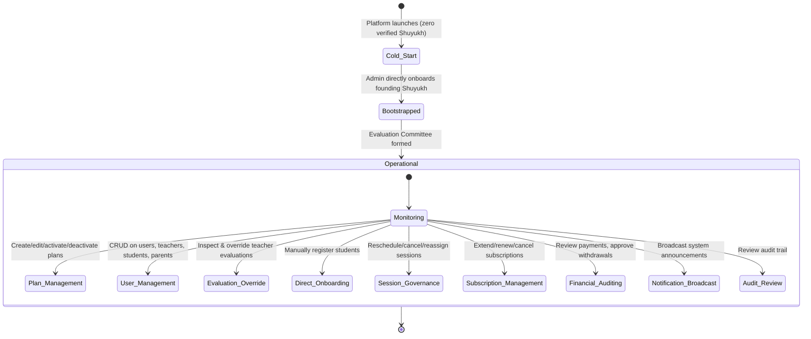
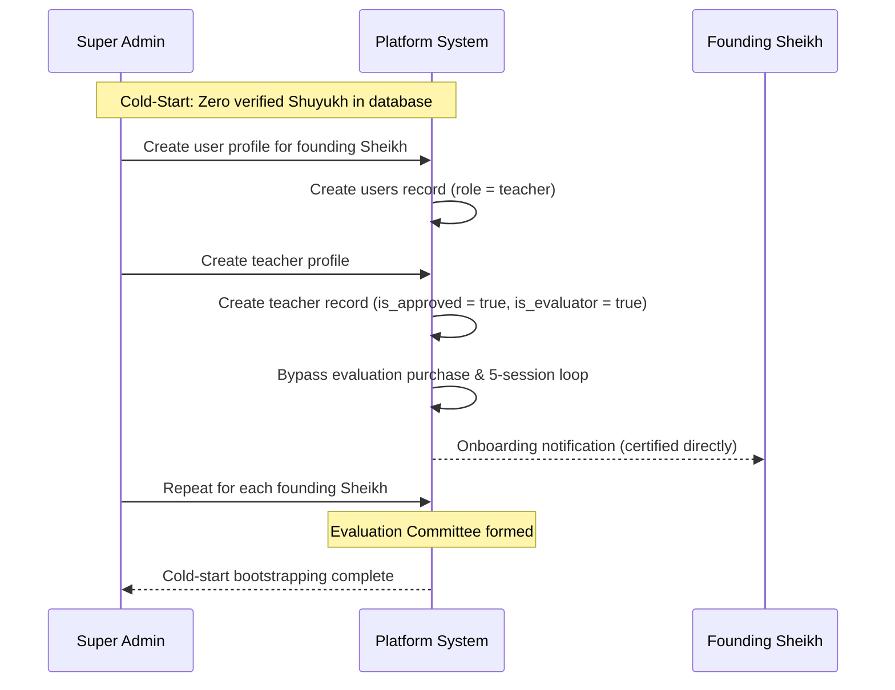
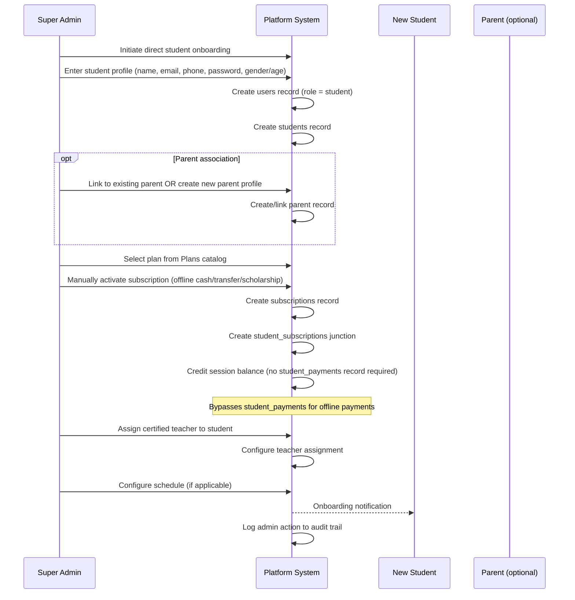
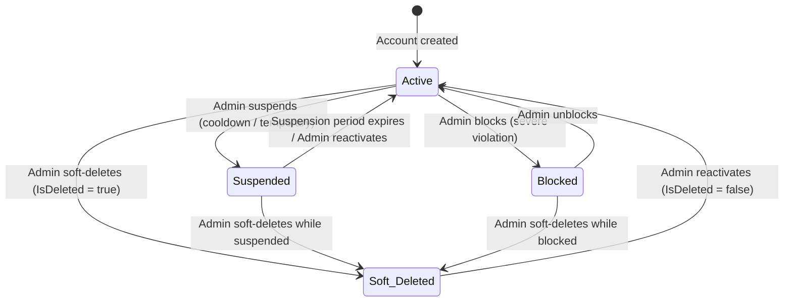
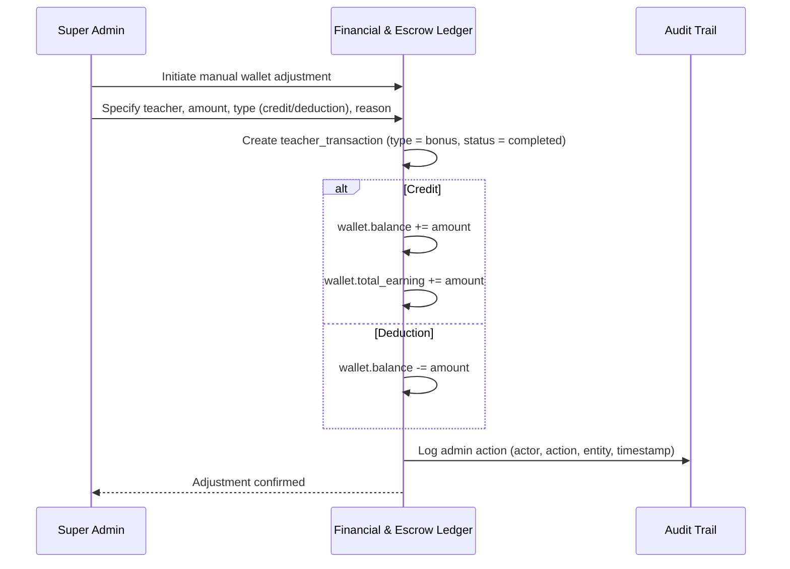

# Workflow 05 — Super Admin Governance & Override

> **Source of truth:** `draft_docs/2-admin-sc.en.md` (all sections), `draft_docs/1-sc.en.md` §10
> **Related:** `docs/domain/GLOSSARY.md`, `docs/specs/state-machine-invariants.md`

---

## 1. Overview

The Super Admin is the supreme orchestrator of the Draft Academy platform, possessing complete end-to-end visibility and administrative authority (Full CRUD Visibility & Control) across all system entities. This workflow covers cold-start bootstrapping, direct student onboarding, soft delete governance, financial auditing, and the audit trail.

---

## 2. State Machine: Admin Governance Actions

---

## 3. Sequence Diagram: Cold-Start Bootstrapping

---

## 4. Sequence Diagram: Direct Student Onboarding

---

## 5. Soft Delete Governance

### 5.1 Soft Delete Rules

| Rule | Detail |
|---|---|
| **Zero Hard Deletes** | Users, Students, and Teachers must **never be hard-deleted** from the database |
| **Soft Delete Mechanism** | `IsDeleted = true` with `deleted_at` timestamp |
| **Data Preservation** | Soft delete preserves session history, educational progress, and financial accounting integrity |
| **Reactivation** | Admin can reactivate accounts by setting `IsDeleted = false` |

### 5.2 Account States

### 5.3 Schema Mapping

| State | Fields |
|---|---|
| **Active** | `suspended = false`, `is_blocked = false`, `is_deleted = false` |
| **Suspended** | `suspended = true`, `suspended_at = <timestamp>`, `suspended_period_days = <N>` |
| **Blocked** | `is_blocked = true`, `blocked_at = <timestamp>` |
| **Soft Deleted** | `is_deleted = true`, `deleted_at = <timestamp>` |

> **Note:** These governance fields exist on the base `users` table (moved from `students` per A.7). **✅ RESOLVED:** Governance fields (`is_deleted`, `suspended`, `is_blocked`, etc.) moved to `users` table, applying to all roles including teachers. See Resolved Decision A.7 in open-decisions-and-gaps.md.

---

## 6. Financial Auditing & Wallet Operations

### 6.1 Incoming Payments Audit

| Capability | Description | Schema |
|---|---|---|
| **Payment Ledger** | Comprehensive ledger of all student and applicant payments | `student_payments` |
| **Status Tracking** | Real-time status tracking (Success, Pending, Failed) | `student_payments.status` |
| **Immutability** | Payment records are immutable; corrections via adjustment transactions only | Data integrity rule |

### 6.2 Teacher Wallet & Payout Operations

| Capability | Description | Schema |
|---|---|---|
| **Balance Inspection** | Real-time balance and earnings inspection for every teacher wallet | `wallet.balance`, `wallet.total_earning` |
| **Withdrawal Approval** | Review, approve, or reject withdrawal/payout requests | `teacher_transaction` (type = withdrawal, status = pending → completed/failed) |
| **Manual Adjustments** | Issue manual balance adjustments (credits or deductions) with audit logging | `teacher_transaction` (type = bonus or adjustment) |

### 6.3 Manual Adjustment Flow

---

## 7. Audit Trail

### 7.1 Audit Log Requirements

Every administrative action is permanently logged with:

| Field | Description |
|---|---|
| **Actor ID** | The admin user who performed the action |
| **Action Type** | create, update, delete/deactivate, status override, financial adjustment |
| **Entity Target** | The specific entity affected (user, teacher, student, plan, subscription, session, wallet, transaction) |
| **Timestamp** | Precise time of action |

### 7.2 Admin Actions Requiring Audit

| Action Category | Specific Actions |
|---|---|
| **User Management** | Create, update, soft delete, reactivate, password reset |
| **Plan Management** | Create, edit, activate, deactivate plans |
| **Subscription Management** | Extend, renew, cancel, upgrade/downgrade |
| **Session Governance** | Reschedule, cancel, reassign, join live session |
| **Evaluation Override** | Manually certify, reject, grant re-evaluation |
| **Financial Adjustment** | Manual wallet credit/deduction, withdrawal approval/rejection |
| **Notification Broadcast** | System-wide or targeted notifications |
| **Cold-Start Bootstrapping** | Direct onboarding and certification of founding Shuyukh |

---

## 8. Data Integrity & Governance Rules

| Rule | Description |
|---|---|
| **Zero Hard Deletes on Users** | Users, Students, and Teachers must never be hard-deleted. Soft delete (`IsDeleted = true`) only. |
| **Immutability of Financial Records** | Payment and payout records (`student_payments`, `teacher_transaction`) are immutable. Corrections via adjustment transactions only. |
| **Permanent Retention of Reports & Recitations** | All session logs, reports, evaluations, and recitation records are stored permanently for dispute resolution and teacher re-evaluations. |

---

## 9. Data Entities Involved

| Entity | Admin Governance Role |
|---|---|
| `users` | Full CRUD; soft delete; password resets |
| `admin` | Admin identity (shared PK with users) |
| `teacher` | Cold-start certification; `is_approved`, `is_evaluator` management |
| `students` | Direct onboarding; suspension/block/soft-delete governance |
| `plans` | Create, edit, activate, deactivate |
| `subscriptions` | Extend, renew, cancel, upgrade/downgrade |
| `student_subscriptions` | Direct subscription activation |
| `session` | Reschedule, cancel, reassign, monitor |
| `student_payments` | Audit ledger; status tracking |
| `wallet` | Balance inspection; manual adjustments |
| `teacher_transaction` | Withdrawal approval; adjustment transactions |
| `reports`, `evaluations` | Review for evaluation override; permanent retention |
| `audit_logs` | Permanent logging of all admin actions — ✅ RESOLVED (A.5) |
| `notifications` | Broadcast system announcements — ✅ RESOLVED (A.4) |

---

## 10. Resolved Decisions

> See Resolved Decisions in `docs/specs/open-decisions-and-gaps.md` for the full catalog.

- **✅ RESOLVED (A.7):** Governance fields (`is_deleted`, `deleted_at`, `suspended`, `suspended_at`, `suspended_period_days`, `is_blocked`, `blocked_at`) moved to the base `users` table, applying to all roles including teachers.
- **✅ RESOLVED (A.5):** `audit_logs` table created in the database with `audit_action_type` enum for immutable admin action logging.
- **✅ RESOLVED (A.4):** `notifications` table created in the database with `notification_type` enum for persisted notifications.
- **✅ RESOLVED (B.9):** Payment method fields added to `subscriptions` (`payment_method`, `payment_reference`, `payment_verified_at`). Offline payments (cash, bank transfer, scholarships) are tracked via these fields, maintaining the audit trail.
- **✅ RESOLVED (B.10):** On-demand model — students browse and request. The admin "assign" capability is interpreted as a recommendation/routing hint, not a fixed assignment.
- **✅ RESOLVED (B.8/C.2):** `subscriptions.teacher_id` renamed to `subscriptions.user_id` (FK to `users`). Any user (teacher or student) can own a subscription.
- **✅ RESOLVED (B.17):** Prorated balance handling on plan upgrade/downgrade. Remaining session balance is prorated; validity window resets to the new plan's `interval_days`.
